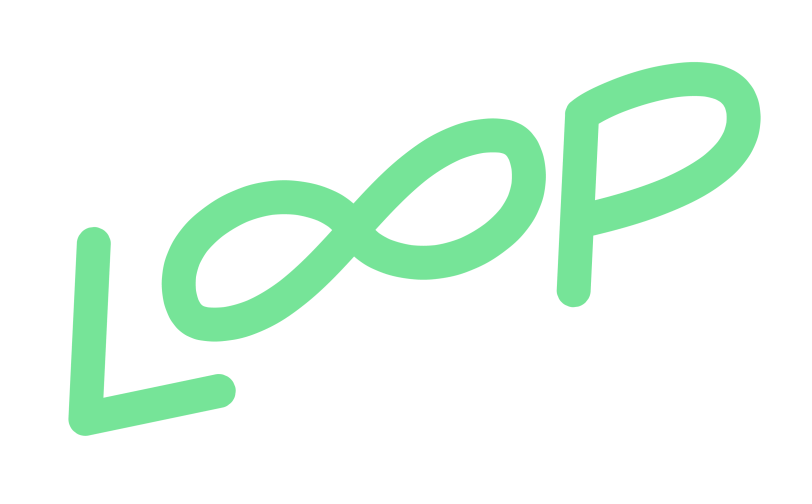
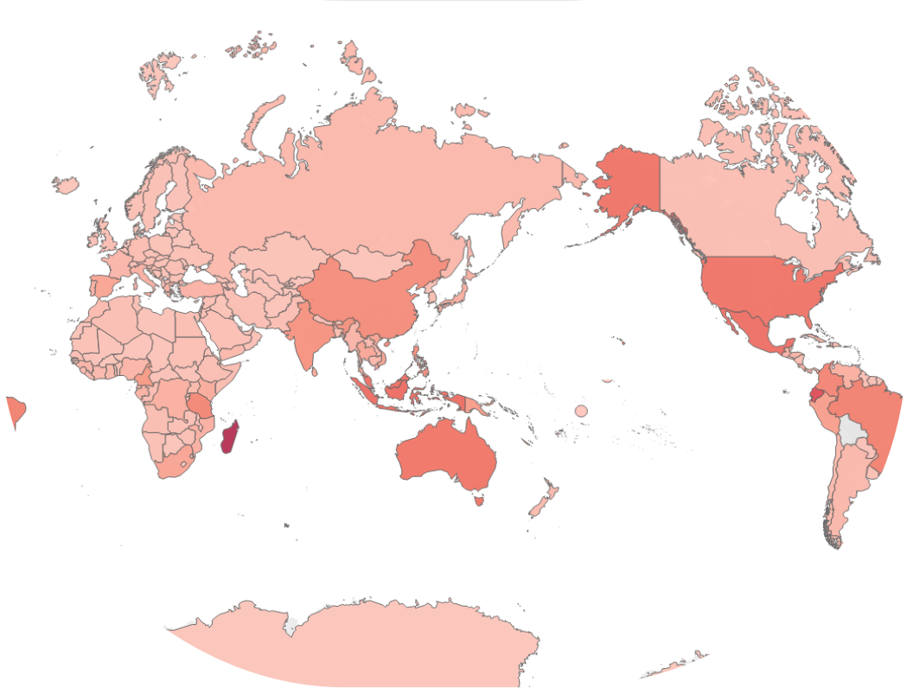
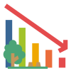
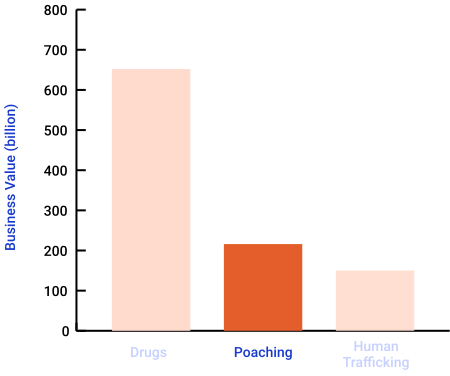
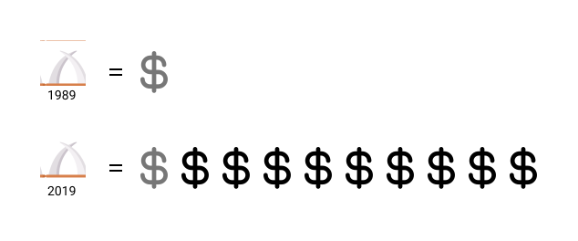
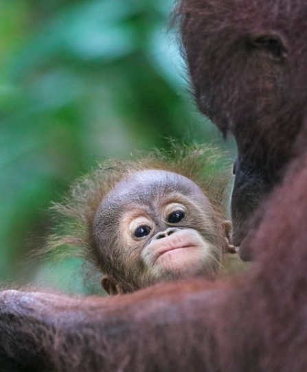
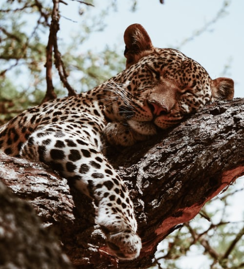
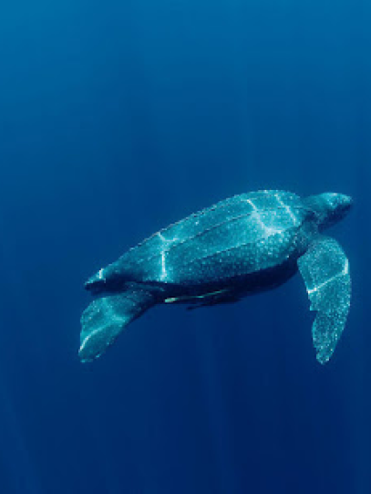

<!DOCTYPE html>
<html>
<title>Loop</title>
<meta charset="UTF-8">
<meta name="viewport" content="width=device-width, initial-scale=1">
<link rel="stylesheet" href="w3.css">
<link rel="stylesheet" href="https://fonts.googleapis.com/css?family=Raleway">
<link rel="preconnect" href="https://fonts.gstatic.com">
<link href="https://fonts.googleapis.com/css2?family=Nunito:wght@200;400&display=swap" rel="stylesheet">
<link rel="stylesheet" href="https://cdnjs.cloudflare.com/ajax/libs/font-awesome/4.7.0/css/font-awesome.min.css">
<link rel="icon" href="greenlogo.svg"/>

<body>
  <body style="background-color: #c6d1ff;"></body>

<!-- Navbar (sit on top) -->

  

    
    <!-- Right-sided navbar links -->
    

      <a href="#causes" class="w3-bar-item w3-button w3-padding-32">Causes of Extinction</a>
      <a href="#animals" class="w3-bar-item w3-button w3-padding-32">Endangered Animals</a>
    

    <!-- Hide right-floated links on small screens and replace them with a menu icon -->

    <a href="javascript:void(0)" class="w3-bar-item w3-button w3-right w3-hide-large w3-hide-medium" onclick="w3_open()">
      <i class="fa fa-bars"></i>
    </a>
  

<!-- Sidebar on small screens when clicking the menu icon -->
<nav class="w3-sidebar w3-bar-block w3-black w3-card w3-animate-left w3-hide-medium w3-hide-large" style="display:none" id="mySidebar">
  <a href="javascript:void(0)" onclick="w3_close()" class="w3-bar-item w3-button w3-large w3-padding-16">Close ×</a>
  <a href="#about" onclick="w3_close()" class="w3-bar-item w3-button">ABOUT</a>
  <a href="#team" onclick="w3_close()" class="w3-bar-item w3-button">TEAM</a>
  <a href="#work" onclick="w3_close()" class="w3-bar-item w3-button">WORK</a>
  <a href="#pricing" onclick="w3_close()" class="w3-bar-item w3-button">PRICING</a>
  <a href="#contact" onclick="w3_close()" class="w3-bar-item w3-button">CONTACT</a>
</nav>

<!-- Map Section -->

  <h1 style="font-weight: bold">Do you know that animals are disappearing?</h1>
  
In both the worlds of animals and plants, there are now 41,415 species on the IUCN Red List (endangered species list), 
    and  16,306 of them are endangered species threatened with extinction. Learn more about the endangered species from 
    the story below.  
    Hover on to the map to learn more about the number of endangered species in each country. 
    Also, click on the icon to learn about the top 10 endangered animals as of 2020.

    

<!-- Tab Section -->

    <h3 class="w3-center">Three Main Causes of Animal Extinction</h3>  
<button class="tablink" onclick="openCity('habitat', this, '#c6d1ff')" id="defaultOpen">
  

    

      
      

        <h3 style="color: black; font-weight: bold;">Habitat Loss</h3>
        
Habitat loss may be the greatest threat to biodiversity on earth, affecting 85% species. Most habitat loss is due to intense harvesting and agricultural expansion by human.

      

    

  

</button>
<button class="tablink" onclick="openCity('poaching', this, '#c6d1ff')">  
  

  

    
    

      <h3 style="color: black; font-weight: bold;">Poaching</h3>
      
Poaching is the illegal hunting, capture or collection of wildlife by human that leads to the maiming
        of many animals not intended for consumption and in some cases, extinction.

    

  

</button>
<button class="tablink" onclick="openCity('climate', this, '#c6d1ff')">  

  

    
    

      <h3 style="color: black; font-weight: bold;">Climate Change</h3>
      
Human adds greenhouse gasses to the atmosphere, which arise the planet’s temperature, consequently melting ice caps, raising sea levels and warming oceans.

    

  

</button>

  

      
    

      

        

          

            <h3 style="color: black; font-weight: bold;">Top 3 Lucrative Crimes</h3>
            
lllegal wildlife trafficking is the second most lucrative crime globally,  with
              $73–$216 billion estimated yearly value.The first one is drugs, with $426–
              $652 billion estimated yearly value. Human trafficking is third, with an
              estimated $150 billion.

              
          

        

      

      

        

          

            <h3 style="color: black; font-weight: bold;">Ivory Price Rose by 10x</h3>
            
The price increase occurred in only 30 years after the CITES issued a worldwide ban on 
              ivory trading in 1989.

              
          

        

      

    

  

  

      
    

      

        

          

            <h3 style="color: black; font-weight: bold;">Top 3 Lucrative Crimes</h3>
            
lllegal wildlife trafficking is the second most lucrative crime globally,  with
              $73–$216 billion estimated yearly value.The first one is drugs, with $426–
              $652 billion estimated yearly value. Human trafficking is third, with an
              estimated $150 billion.

              
          

        

      

      

        

          

            <h3 style="color: black; font-weight: bold;">Ivory Price Rose by 10x</h3>
            
The price increase occurred in only 30 years after the CITES issued a worldwide ban on 
              ivory trading in 1989.

              
          

        

      

    

  

  

      
    

      

        

          

            <h3 style="color: black; font-weight: bold;">Top 3 Lucrative Crimes</h3>
            
lllegal wildlife trafficking is the second most lucrative crime globally,  with
              $73–$216 billion estimated yearly value.The first one is drugs, with $426–
              $652 billion estimated yearly value. Human trafficking is third, with an
              estimated $150 billion.

              
          

        

      

      

        

          

            <h3 style="color: black; font-weight: bold;">Ivory Price Rose by 10x</h3>
            
The price increase occurred in only 30 years after the CITES issued a worldwide ban on 
              ivory trading in 1989.

              
          

        

      

    

  

  

<!-- 3 Causes Section -->

  <h3 class="w3-center">Explore Endangered Animals</h3>
  

    

      

        

          

            
          

          

            <h1>John Doe</h1>
            
Architect & Engineer

            
We love that guy

          

        

      

    

    

      

        

          

            
          

          

            <h1>John Doe</h1>
            
Architect & Engineer

            
We love that guy

          

        

      

    

    

      

        

          

            
          

          

            <h1>John Doe</h1>
            
Architect & Engineer

            
We love that guy

          

        

      

    

  

<!-- Promo Section "Statistics" -->

  

    41,415
     Species Listed on the Red List
  

  

    40%
     Endangered Specied
  

  

    10%
     Increased From Last Year
  

<!-- 3 Causes Section -->

  <h3 class="w3-center">Three Main Causes of Animal Extinction</h3>
  

    

      

        
        

          <h3 style="color: black; font-weight: bold;">Habitat Loss</h3>
          
Habitat loss may be the greatest threat to biodiversity on earth, affecting 85% species. Most habitat loss is due to intense harvesting and agricultural expansion by human.

        

      

    

    

      

        
        

          <h3 style="color: black; font-weight: bold;">Poaching</h3>
          
Poaching is the illegal hunting, capture or collection of wildlife by human that leads to the maiming
            of many animals not intended for consumption and in some cases, extinction. 

        

      

    

    

      

        
        

          <h3 style="color: black; font-weight: bold;">Climate Change</h3>
          
Human adds greenhouse gasses to the atmosphere, which arise the planet’s temperature, consequently melting ice caps, raising sea levels and warming oceans. 

        

      

    

  

<!-- 2 Causes Section -->

  

    

      

        

          <h3 style="color: black; font-weight: bold;">Top 3 Lucrative Crimes</h3>
          
lllegal wildlife trafficking is the second most lucrative crime globally,  with
            $73–$216 billion estimated yearly value.The first one is drugs, with $426–
            $652 billion estimated yearly value. Human trafficking is third, with an
            estimated $150 billion.

            
        

      

    

    

      

        

          <h3 style="color: black; font-weight: bold;">Ivory Price Rose by 10x</h3>
          
The price increase occurred in only 30 years after the CITES issued a worldwide ban on 
            ivory trading in 1989.

            
        

      

    

  

<!-- Footer -->
<footer class="w3-center w3-black w3-padding-64">
  <a href="#home" class="w3-button w3-light-grey"><i class="fa fa-arrow-up w3-margin-right"></i>To the top</a>
</footer>
 

</body>
</html>
